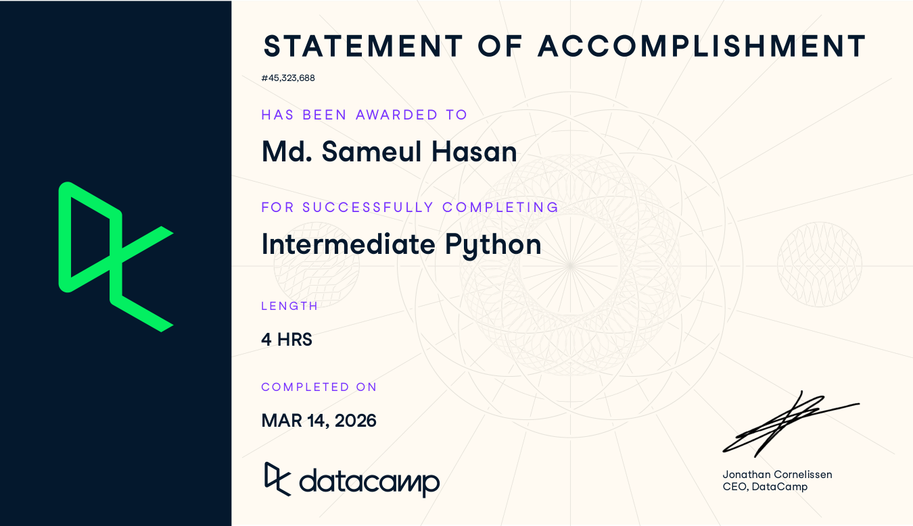
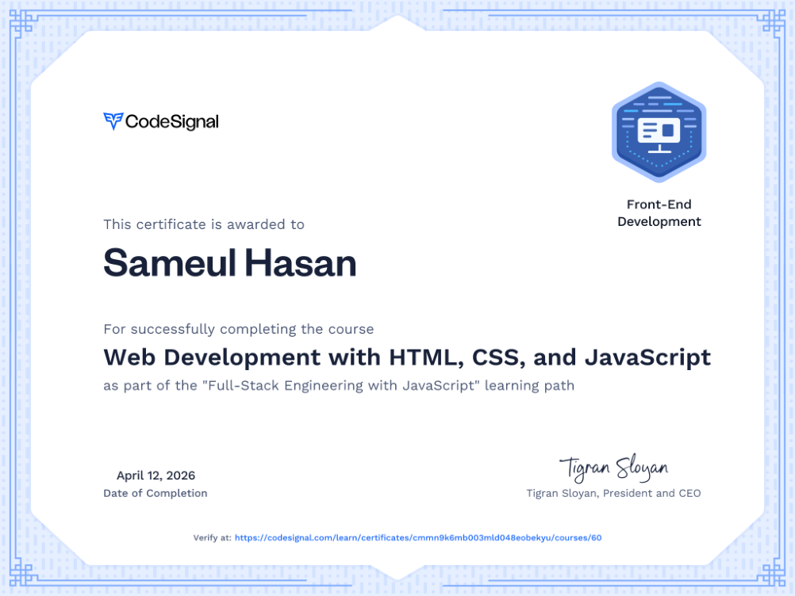
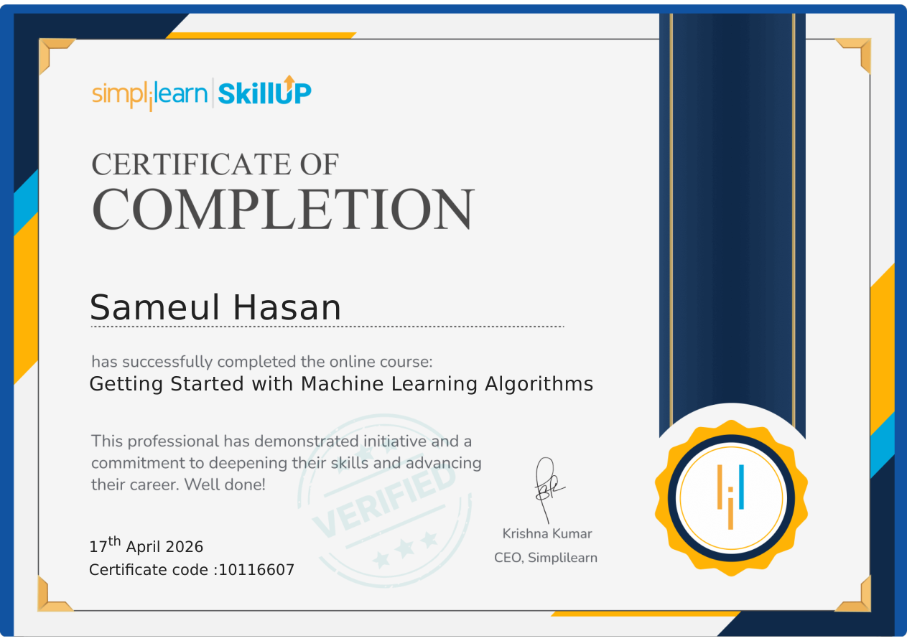
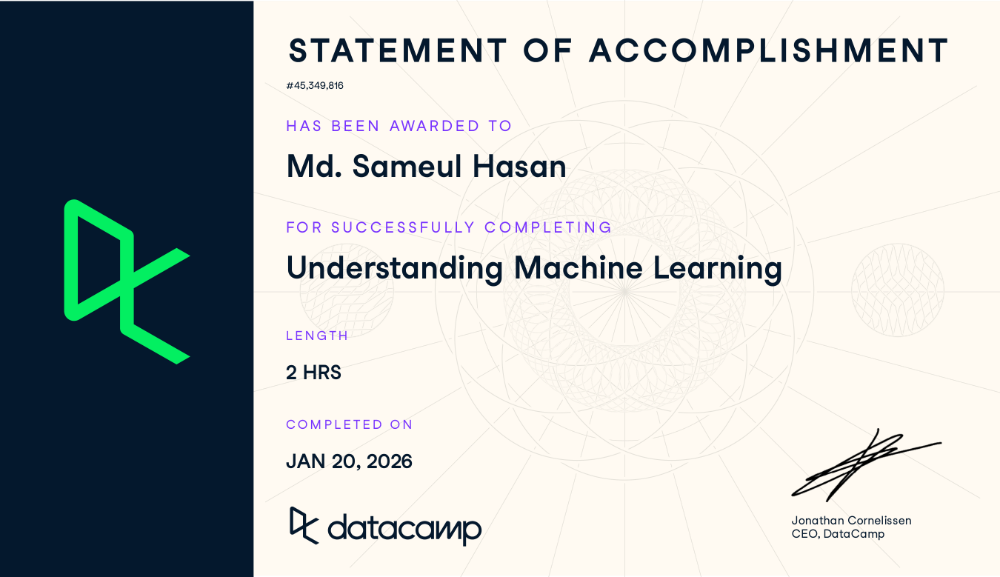
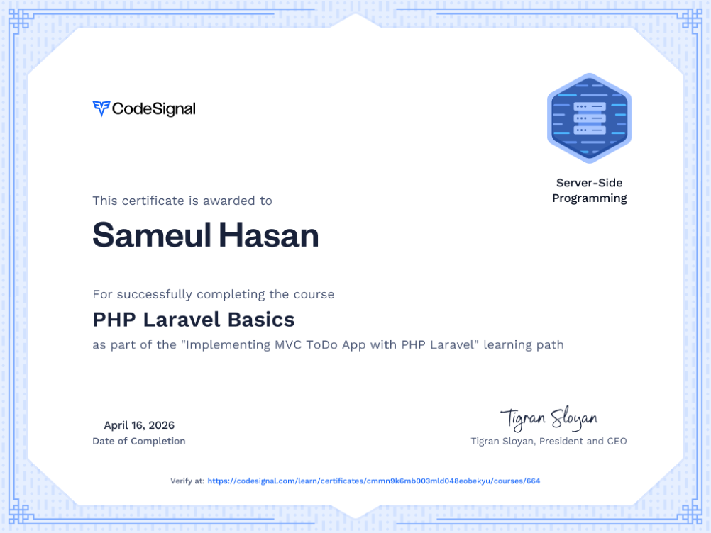

<div align="center">
  

  ### 🏆 A Showcase of My Professional Growth and Achievements
  
  [](https://github.com/sameul-hasan)
  [](https://github.com/sameul-hasan/Cirtification-I-Have/commits/main)
</div>

<br/>

## 📂 How it is Organized (Where to Upload)

To keep things perfectly organized, I highly recommend creating a **`certificates/`** folder inside this repository. 

Whenever you earn a new certificate, simply upload the image (`.png`, `.jpg`) or document (`.pdf`) into a structured folder based on the year or category. 

**Example Structure:**
```text
📁 certificates/
 ├── 📁 2023/
 │    └── aws-cloud-practitioner.png
 └── 📁 2024/
      └── github-foundations.pdf
```
*Note: Any time you upload a file into the repository, the gallery below will automatically update!*

<br/>

## 🌟 Certificate Gallery

<!-- START_SECTION:certificates -->
| | |
| :---: | :---: |
| <br>_Statement of Accomplishment: Intermediate Python by DataCamp_ | <br>_CodeSignal: Web Development with HTML, CSS, and JavaScript_ |
| <br>_Simplilearn SkillUp Certificate of Completion for Getting Started with Machine Learning Algorithms_ | <br>_Statement of Accomplishment by DataCamp for Understanding Machine Learning_ |
| <br>_CodeSignal PHP Laravel Basics Certificate_ |  |

<!-- END_SECTION:certificates -->

<br/>

## 🤝 Let's Connect

I am always open to discussing technology, professional growth, and new opportunities. Feel free to reach out to me through any of the platforms below:

<div align="center">
  <a href="mailto:sameul.barishal@gmail.com">
    
  </a>
  <a href="https://github.com/sameul-hasan">
    
  </a>
  <a href="https://linkedin.com/in/">
    
  </a>
</div>
